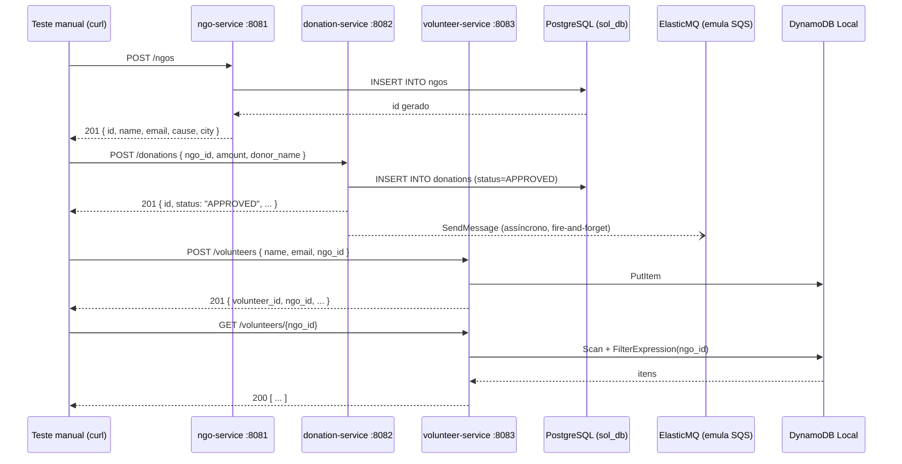

| [↩️ Voltar](./) |
| --- |

# Arquitetura

> ⚠️ **_Em construção_**

Este é um resumo da arquitetura do ambiente da SolidaryTech.

 

## Microserviços

A SolidaryTech possui 3 microsserviços independentes, desenvolvidos com tecnologias diferentes para simular um ambiente corporativo distribuído.

1. **`ngo-service`**: (_Non-Gorvermental Organization_) responsável pelo gerenciamento e cadastro das ONGs parceiras da plataforma.
2. **`donation-service`**: responsável pelo processamento das doações e publicação de eventos assíncronos em filas para processamento posterior (_Caminho Crítico/Hot Path_).
3. **`volunteer-service`**: gerencia o cadastro e inscrição de voluntários interessados em apoiar as ONGs parceiras.

O [`README.md`](/) original descreve os 3 microserviços isoladamente, mas não deixa claro **quais endpoints existem**, **quais campos cada um espera** e **como uma ONG se conecta a doações e voluntários**. Este resumo cobre os três pontos, na forma de uma cadeia de chamadas manuais que podem ser [reproduzidas manualmente com o `curl`][testemanual].

 

### Como os microserviços se correlacionam

Os três serviços **não se chamam entre si**. A única correlação é o campo `ngo_id`, que `donation-service` e `volunteer-service` gravam como um número inteiro solto. **Nenhum dos dois valida se a ONG existe** no `ngo-service`. Isso significa que, nos testes, é perfeitamente possível (e não gera erro) criar uma doação ou um voluntário apontando para um `ngo_id` inexistente.

> **Vale ter isso em mente ao interpretar os resultados.**

 

## Tabela de endpoints

| Serviço               | Método | Rota                   | Body (JSON)                  | Sucesso                                         | Erros conhecidos |
| --------------------- | :----: | ---------------------- | :--------------------------- | :---------------------------------------------- | :--------------- |
|                       | GET    | `/health`              | -                            | `200`                                           | -                |
| **ngo-service**       | POST   | `/ngos`                | `name, email, cause, city`   | `201` + registro completo                       | `400` Campo ausente - `409` E-mail duplicado - `500` Erro interno |
|                       | GET    | `/ngos`                | -                            | `200` + lista                                   | `500` Erro interno |
| --------------------- | ------ | ---------------------- | ---------------------------- | ----------------------------------------------- | ---------------- |
|                       | GET    | `/health`              | -                            | `200`                                           | - |
| **donation-service**  | POST   | `/donations`           | `ngo_id, amount, donor_name` | `201` + registro (`status` sempre `"APPROVED"`) | `400` Payload inválido - `500` Erro interno |
|                       | GET    | `/donations`           | -                            | `200` + lista                                   | `500` Erro interno |
| --------------------- | ------ | ---------------------- | ---------------------------- | ----------------------------------------------- | ---------------- |
|                       | GET    | `/health`              | -                            | `200`                                           | - |
| **volunteer-service** | POST   | `/volunteers`          | `name, email, ngo_id`        | `201` + registro (`volunteer_id` UUID gerado)   | `400` Campo ausente ou inválido - `500` Erro interno ao processar dados |
|                       | GET    | `/volunteers/<ngo_id>` | num inteiro no path          | `200` + lista filtrada                          | `404` se `ngo_id` não for inteiro - `500` Erro interno |

| [⬆️ Top](#arquitetura) |
| --- |

[testemanual]: ./teste-manual.md