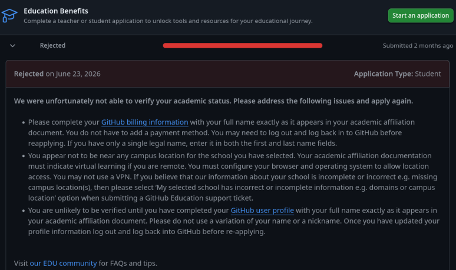

| [↩️ Voltar](./) |
| --- |

# Estrutura de disciplinas - "Hackathon" SolidaryTech

> ⚠️ **_Em construção_**

Abaixo são descritas algumas das disciplinas utilizadas neste projeto.

 

## 1. Fundamentos DevOps

O projeto utiliza algumas disciplinas principais de DevOps, conforme descrito a seguir.

 

### 1.1 Docker/Podman - Containers

- Dockerfiles otimizados para o _build_ dos 3 microserviços e implantação no Kubernetes.
    - Os microserviços utilizam imagens reduzidas, como `alpine`.
    - Possuem _stage build_ otimizado para redução de artefatos quando necessário (_donation-service_).
- Três microserviços independentes (`ngo-service`, `donation-service` e `volunteer-service`), cada um com seu próprio banco/storage (Postgres, Postgres+SQS e DynamoDB, respectivamente).
- Stack completa em `build/docker-compose.yaml`, incluindo emuladores locais de nuvem: ElasticMQ (SQS) e DynamoDB Local, para não depender de conta AWS real durante desenvolvimento e testes.

 

### 1.2 CI e DevSecOps

Trata-se de um modelo onde o Git é a fonte de verdade e o próprio cluster K8s sincroniza as mudanças. Esse formato mantém o ambiente em um estado desejado de forma declarativa trazendo mais flexibilidade e portabilidade.

🔶 **Gitea e GitHub com pipeline de CI** - Pipeline de CI para os 3 microsserviços do SolidaryTech, cobrindo aspectos de qualidade e segurança de código, teste de integração de ponta a ponta contra a stack real, seguidos de build, scan e publicação de [imagens no Docker Hub][dockerhub].

Os dois workflows equivalentes ([`.gitea/workflows/ci-cd.yaml`][cigitea] e [`.github/workflows/ci-cd.yaml`][cigithub]) possuem uma divisão de responsabilidades clara com três estágios sequenciais:

1. **SAST/SCA por serviço**: lint (`golangci-lint` ou `ruff`), SCA de dependências via Trivy (_bloqueia CRITICAL_), e SAST (`gosec/bandit`, não bloqueante_).
2. **_Smoke test_ de ponta a ponta**: sobe a stack real via docker compose e executa o script `build/scripts/smoke-test.sh` contra os três serviços (_incluindo checagem da fila no ElasticMQ_).
3. **Build, scan de imagem e push**: construção de cada imagem, novo scan Trivy na imagem final e push para o Docker Hub (_`diasdmhub/{ngo,donation,volunteer}`_), com tag versionada como timestamp UTC (_para o Flux Image Automation_) e _latest_ quando a branch é `main`.

 

### 1.3 Gitops (CD)

O pipeline CI combinado ao FluxCD formam duas metades de um macro fluxo de GitOps.

🔶 **FluxCD** - O cluster é gerenciado inteiramente pelo FluxCD, a partir das definições em [`clusters/kubeadm-local/`][fluxcd] a fim de fazer o _deploy_ dos serviços. Ele detecta quando novas tags são publicadas e faz o _commit_ na branch `main`. O ciclo se fecha com o Kustomization dos serviços que aplicam a nova imagem no cluster.

São declarados 3 conciliações com manifestos do Kubernetes:

1. [`kube/kube-aws`][kube] - Manifestos da SolidaryTech.
2. [`observe/`][observe] - Manifestos de serviços de monitoração e observabilidade (só no cluster local; no EKS, esses mesmos serviços são aplicados pelo Terraform - ver `terra/README.md`).
3. [`image-automation/`][imageauto] - Manifestos para atualização de imagens dos serviços.

 

### 1.4 Infraestrutura como Código (IaC)

Provisionamento de todo o ambiente (Cluster, Bancos de Dados, Mensageria, Rede) via Terraform.

- Os recursos da AWS foram implementados como módulos do Terraform de modo a facilitar o gerenciamento e possíveis manutenções.
- Consistência de tags em todos os recursos AWS e Kubernetes, tanto para o ambiente local como para o ambiente _cloud_.
- Foco em Free-tier deliberado. Alguns custos são inevitáveis, como o control plane do EKS, o NAT Gateway e EBS.

 

### 1.5 Kubernetes

> **O projeto foi estruturado em plataformas de desenvolvimento e produção.**

🔶 Para desenvolver o ambiente, foi utilizado uma infraestrutura de Kubernetes local. Esse desenvolvimento foi iniciado com a implementação de uma _stack_ de serviços com o Docker Compose. Em seguida, a _stack_ foi reorganizada em manifestos para _deploy_ em cluster K8s. Os recursos foram organizados separadamente, e labels padronizadas (`Project: SolidaryTech`, `Environment: primary`, `app.kubernetes.io/part-of`). Posteriormente o ambiente foi replicado na AWS.

Deploy testado ponta a ponta no cluster remoto. Os serviços da SolidaryTech compartilham um único _endpoint_ externo com portas distintas por serviço, aproximando o ambiente de um cenário de nuvem real com custo reduzido.

 

### 1.6 Observabilidade e APM

Stack completa executando Prometheus, Loki e Alloy. Códigos dos microserviços instrumentados para o APM Tempo com Distributed Tracing.

- **Tracing distribuído**: OTLP dos 3 serviços, com correlação log etrace via trace_id nas linhas de log. _equivalente ao "Log-Trace Correlation" do Datadog._
- **Service map / RED metrics**: o _service-graphs_ processor do Tempo gera o mapa de dependências entre serviços; o _span-metrics_ processor gera traces, incluindo dimensão extra para, cobrir erros 4xx - _equivalente ao Service Map + APM metrics do Datadog._
- **Auto-instrumentação**: opentelemetry-instrument nos serviços Python; instrumentação manual no Go - _cobre o caso funcional, similar a bibliotecas que o agente Datadog usa._
- **Infra metrics**: kube-state-metrics (estado de pods/deployments/daemonsets/statefulsets/nodes) e node-exporter (CPU/memória/disco/rede por node), scrapeados pelo próprio Prometheus, cobrem a camada de nó/cluster - _papel equivalente ao Infrastructure Monitoring do Datadog._

 

## SRE

Definidos **SLIs de latência e erros** para todos os serviços da SolidaryTech. Devido à relevância do Donation Service (_hot-path_), foi especificado um SLO de `98%`, estabelecendo, assim, um _error budget_ de `2%`.

Essa especificação é relativa a um **período mensal** de `720h`, contabilizando o mínimo de `705,6h` de disponibilidade do serviço e `14.4h` de tolerância a erros. Esses valores estabelecem uma margem segura de manutenções e atualizações do ambiente, caso necessário, e mantêm um alta disponibilidade para os clientes.

A quebra do SLO, implicará no congelamento imediato de atualizações programadas do Donation Service e exige a estabilização do ambiente até o próximo período mensal e alívio do _error budget_.

 

## FinOps

- O ambiente foi inteiramente implementado com o **Terraform** aplicando as tags abaixo:

| Tag | Valor |
| :---: | :---: |
| Project | `SolidaryTech` |
| Environment | `Production` |
| CostCenter | `NGO-Core` |
| ManagedBy | `Terraform` |

- O padrão de "Tag Name" por recurso (`${name_prefix}-<recurso>`) está presente em praticamente todos recursos do Terraform, para identificação individual ou por filtros na AWS.
- Os recursos de CPU e memória disponibilizados aos serviços da SolidaryTech foram otimizados com base no histórico de uso, tendo os _requests_ e _limits_ sido aplicados conforme esse histórico.
- Foi utilizado somente o **recurso de HPA** para os serviços da SolidaryTech no cluster K8s, pois ele pode escalar a quantidade de pods automaticamente e absorver picos de carga. Caso, a carga seja reduzida, os pods são reduzidos e o consumo de recursos também.
- O VPA foi descartado dessa implementação pois causaria divergência entre entre o repositório Git remoto com o cluster, e o FluxCD teria um _drift_ a cada reconciliação.

 

## APM

Similar à fase 4 do curso DCLT, **não é viável a implementação das ferramentas de APM a seguir.**

- **Datadog**:
    - [Exige conexão com serviços de terceiros (GitHub)][datadog_edu] para acesso educativo.
    - O GitHub exige, por meio de seu [pacote para estudantes][github_edu], exige informações de identificação governamentais e um rastreamento biométrico altamente invasivo para registro.
    - Ambas as empresas coletam dados pessoais, comportamentais, biométricos e de rastreamento de usuários, que podem ser compartilhados com terceiros, utilizados em perfilarizações comerciais, marketing, treinamento de IA, entre outras ações. Tudo isso ocorre sem um prazo de retenção definido ou garantias reais de privacidade.
    - Tentativas de registro no programa educacional do GitHub **foram rejeitadas**. Uma das justificativas alega que não há proximidade geográfica do aluno com a instituição, a qual não indicou a oferta de estudo virtual.
    
- **New Relic**: o [**portal continua indisponível**][newrelic], pois tem recusado conexões (_ERR_CONNECTION_REFUSED_) durante o desenvolvimento desta fase. Não foi possível acessar os recursos desse serviço.
- Diante dessas políticas e restrições, entendo ser invasivo e inviável a filiação às instituições acima. _Fico à disposição para maiores esclarecimentos._

O **Tempo** foi definido como a ferramenta de APM para este ambiente, pois oferece os recursos de rastreamento e observabilidade necessários para os serviços da SolidaryTech, e já é integrado à ferramenta de observabilidade Grafana. Além disso, sua implementação e uso não geram custos adicionais, aderindo às premissas de economia de custos esperadas para a organização.

 

## ITSM e AIOps

Quanto aos aspectos de ITSM, o Zabbix é utilizado como ferramenta central de eventos devido sua flexibilidade com diversas ferramentas de mercado, e devido ao seu baixo custo, pois é open-source. Integrado a ele, estão recursos de tratamento e automatção de eventos. No ambiente implementado, ele inclui:

- alta performance em monitoramento e observabilidade;
- integração diversificada com plataformas de notificação;
- gerenciamento de eventos;
- personalização de mensagens e relatórios;
- ausência de custos de licenciameto;
- integração com IA;

 

## Multicloud, Segurança e Disaster Recovery (DR)

 

## Artefatos

- Documentação de arquitetura e teste manual em `doc/`.

 

| [⬆️ Top](#estrutura-de-disciplinas---hackathon-solidarytech) |
| --- |

[cigitea]: /.gitea/workflows/ci-cd.yaml
[cigithub]: /.github/workflows/ci-cd.yaml
[fluxcd]: /clusters/kubeadm-local/
[kube]: /kube/
[observe]: /observe/
[imageauto]: /image-automation/
[dockerhub]: https://hub.docker.com/u/diasdmhub
[datadog_edu]: https://studentpack.datadoghq.com
[github_edu]: https://education.github.com/pack
[newrelic]: https://newrelic.com