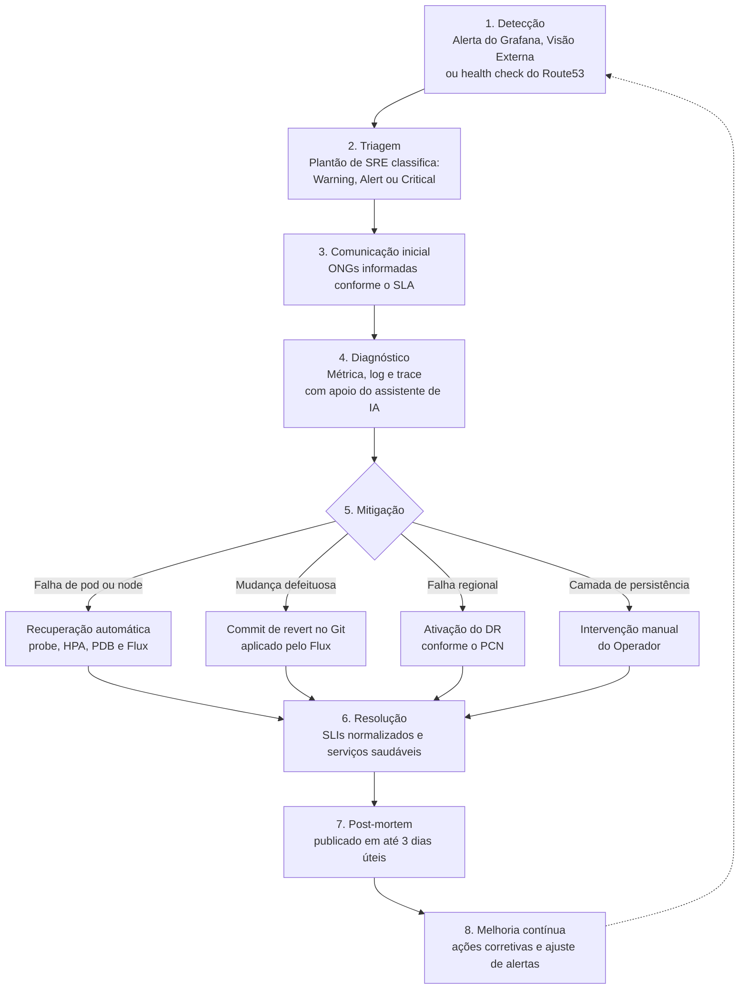

| [↩️ Voltar](/) |
| --- |

# Ciclo de vida de incidentes

Este documento descreve como um incidente da SolidaryTech é tratado, da detecção ao _post-mortem_ e à comunicação com as ONGs. O foco é o `donation-service`, o _hot path_ da plataforma, cujos compromissos estão em [`doc/sla.md`][sla].

 

## Visão geral

 

## Fases, responsáveis e ferramentas

Os papéis são os definidos no [PCN][pcn]: o **Plantão de SRE** decide e coordena, e o **Operador**, com acesso à conta AWS e ao _state_ do Terraform, executa as ações de infraestrutura.

| Fase | Responsável | O que acontece | Ferramentas |
| --- | --- | --- | --- |
| **1. Detecção** | Automática | Uma regra de alerta dispara e o Grafana IRM notifica o Plantão de SRE. A Visão Externa e o health check do Route53 cobrem falhas vistas de fora do cluster | Regras de alerta, Grafana IRM |
| **2. Triagem** | Plantão de SRE | Confirma se o alerta é real, mede o impacto no SLO e no SLA e atribui a severidade | Dashboard de Golden Metrics |
| **3. Comunicação inicial** | Plantão de SRE | Informa as ONGs quando o critério do SLA é atendido, com atualizações até a normalização | [`doc/sla.md`][sla] |
| **4. Diagnóstico** | Plantão de SRE | Parte da métrica, chega ao log e ao _trace_ pelo `trace_id`, e identifica a causa | Prometheus, Loki, Tempo, assistente de IA |
| **5. Mitigação** | Automática, Operador ou Plantão de SRE | Aplica o caminho de recuperação adequado à causa (ver abaixo) | Kubernetes, Flux, Git, Terraform |
| **6. Resolução** | Plantão de SRE e Operador | Confirma que os SLIs voltaram ao normal e que os 3 serviços estão saudáveis, e encerra o incidente | Dashboards, Grafana IRM |
| **7. Post-mortem** | Plantão de SRE | Publica o relatório em até 3 dias úteis, com causa raiz, impacto, linha do tempo e ações corretivas | [`doc/sla.md`][sla] |
| **8. Melhoria contínua** | Plantão de SRE | Transforma as ações corretivas em mudanças versionadas no Git, como novos alertas, limites ou correções | Git, Flux |

### Caminhos de mitigação

- **Falha de pod ou node:** a recuperação é automática, sem intervenção humana (_liveness probe_, HPA, PDB e reconciliação do Flux). Ver a seção "SRE" de [`doc/estrutura.md`][estrutura].
- **Mudança defeituosa:** o caminho é um _commit_ de _revert_ na branch `main`, que o Flux aplica. É o caso de um _deploy_ que renomeia por engano o endpoint `/donations`, o que faz os clientes receberem 404. Assim, a correção segue a regra de não haver _deploy_ manual via `kubectl`.
- **Falha regional:** o Plantão de SRE decide declarar o desastre e o Operador executa o [roteiro de ativação do DR][roteirodr]. A decisão é manual de propósito, como explica o [PCN][pcn].
- **Camada de persistência:** Postgres, DynamoDB e SQS não têm recuperação automatizada. A detecção é rápida, mas a resolução depende do Operador, o que eleva o MTTR.

 

## Severidades

| Nível | Critério | Regras atuais | Tratamento |
| --- | --- | --- | --- |
| **Critical** | Impacto direto no doador ou no SLA: `donation-service` com taxa de erro acima de `2%` sustentada, doações paradas ou falha regional | `solidarytech-donation-error-rate` (`severity: critical`) | Plantão notificado de imediato. Comunicação e _post-mortem_ conforme o SLA. Avaliação de ativação do DR se a falha for regional |
| **Alert** | Impacto confirmado e limitado: `ngo-service` ou `volunteer-service` degradados, ou um Warning confirmado que ameaça as doações | Nenhuma regra dedicada. O nível é atribuído na triagem | Tratamento prioritário pelo Plantão. Escala para Critical se atingir o `donation-service` |
| **Warning** | Risco ou anomalia sem impacto confirmado no doador: pods indisponíveis com outras réplicas atendendo, ou silêncio de chamadas ainda não confirmado como falha | `solidarytech-pods-unavailable` e `solidarytech-donation-silence` (`severity: warning`) | Registro e análise pelo Plantão, sem comunicação externa |

O nível pode mudar durante o incidente. Um Warning confirmado sobe para Alert, e qualquer impacto no `donation-service` o eleva a Critical. Por exemplo, o silêncio de chamadas pode ser apenas um período sem uso, mas, se for confirmado como falha de roteamento, passa a Critical.

 

## IA no ciclo

O assistente de IA do Grafana Cloud é usado **sob demanda** pelo Plantão de SRE na triagem e no diagnóstico. Ele ajuda a consultar métricas, logs e _traces_ e a resumir o que foi encontrado. Ele não detecta incidentes nem executa ações sozinho: a decisão e a execução continuam com as pessoas.

A **detecção** hoje é feita por regras de alerta com limites definidos, e não por detecção automática de anomalias por IA. Essa é a principal limitação do ciclo em relação a uma abordagem preditiva.

 

## Métricas de resposta

A linha do tempo registrada no incidente do Grafana IRM permite calcular os tempos abaixo, que sustentam a análise de MTTR:

| Métrica | Intervalo medido |
| --- | --- |
| **MTTD** (detecção) | Do início da falha até o disparo do alerta |
| **MTTA** (reconhecimento) | Do disparo do alerta até o reconhecimento pelo Plantão de SRE |
| **MTTR** (recuperação) | Do início da falha até a resolução |

 

## Limitações conhecidas

- Não há detecção automática de anomalias por IA, apenas regras de alerta.
- O nível **Alert** não tem regra de alerta dedicada, pois é atribuído na triagem. Regras para `ngo-service` e `volunteer-service` são uma evolução natural.
- As regras de alerta são importadas manualmente na interface do Grafana, pois o Git Sync não cobre alertas (ver [`doc/grafana/README.md`][dashgrafana]).
- A decisão de declarar um desastre regional é manual, o que inclui um tempo dependente da equipe no RTO do PCN.

| [⬆️ Top](#ciclo-de-vida-de-incidentes) |
| --- |

[sla]: ./sla.md
[pcn]: ./plano-continuidade-negocios.md
[estrutura]: ./estrutura.md
[roteirodr]: ./roteiro-dr-ativacao.md
[dashgrafana]: ./grafana/README.md
